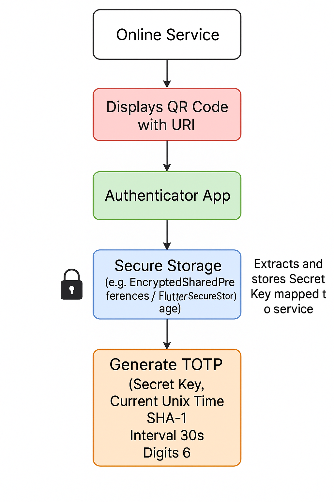

# Totpfy 🔐

A secure, modern TOTP (Time-based One-Time Password) authenticator built with Flutter. Totpfy allows you to generate 2FA codes for your online accounts by scanning QR codes, providing an alternative to apps like Google Authenticator or Authy.

## Demo


## 🌟 Features

- **QR Code Scanning**: Easily add new accounts by scanning QR codes
- **Secure Storage**: All secrets are stored securely using Flutter Secure Storage
- **Real-time OTP Generation**: Automatically generates time-based codes that refresh every 30 seconds
- **Modern UI**: Beautiful, responsive design with dark/light theme support
- **Cross-platform**: Works on iOS, Android, and web
- **Offline Functionality**: No internet connection required for OTP generation
- **Copy to Clipboard**: One-tap copy of generated codes
- **Account Management**: Add, view, and delete TOTP accounts

## 🏗️ Architecture



### App Structure
```
totpfy/
├── lib/
│   ├── main.dart                 # App entry point and routing
│   ├── core/                     # Core business logic
│   │   ├── totp/                 # TOTP generation service
│   │   ├── storage/              # Secure storage implementation
│   │   └── theme.dart           # App theming
│   ├── presentation/             # UI screens
│   │   ├── home_page.dart       # Welcome screen
│   │   ├── dashboard_page.dart  # Main OTP display
│   │   └── qr_scanner_view.dart # QR code scanner
│   ├── providers/               # State management
│   └── common/widgets/          # Reusable UI components
```


## 🚀 Getting Started

### Prerequisites

- [Flutter](https://flutter.dev/docs/get-started/install) (3.7.2 or higher)
- [Dart](https://dart.dev/get-dart) (3.0.0 or higher)
- Android Studio / VS Code with Flutter extensions
- For iOS development: Xcode (macOS only)
- For Android development: Android Studio

### Installation

1. **Clone the repository**
   ```bash
   git clone https://github.com/yourusername/totpfy.git
   cd totpfy
   ```

2. **Install dependencies**
   ```bash
   flutter pub get
   ```

3. **Run the app**
   ```bash
   # For development
   flutter run
   
   # For specific platform
   flutter run -d ios     # iOS
   flutter run -d android # Android
   flutter run -d chrome  # Web
   ```

### Building for Production

```bash
# Android APK
flutter build apk --release

# Android App Bundle
flutter build appbundle --release

# iOS
flutter build ios --release

# Web
flutter build web --release
```

## 📱 Usage

### Adding a New Account

1. **Open Totpfy** on your device
2. **Tap "Scan QR Code"** on the home screen
3. **Point your camera** at the QR code provided by the service (e.g., GitHub, Google, etc.)
4. **The account will be automatically added** and you'll be taken to the dashboard
5. **Use the generated 6-digit code** to complete 2FA setup

### Using TOTP Codes

1. **Open the dashboard** to see all your accounts
2. **Find the account** you need a code for
3. **Copy the 6-digit code** by tapping the copy button
4. **Paste the code** into the service's 2FA input field
5. **Codes automatically refresh** every 30 seconds

### Managing Accounts

- **Delete an account**: Tap the delete icon on any OTP card
- **Add more accounts**: Use the QR scanner icon in the top-right corner
- **View account details**: Tap on any OTP card to see issuer and username

## 🔧 Technical Details

### Dependencies

- **flutter_secure_storage**: Secure storage for TOTP secrets
- **qr_code_scanner_plus**: QR code scanning functionality
- **otp**: TOTP code generation library
- **ntp**: Network time protocol for accurate time synchronization
- **provider**: State management
- **get_it**: Dependency injection
- **carousel_slider**: UI component for security quotes


## 🎨 UI/UX Features

- **Responsive Design**: Works on phones, tablets, and web
- **Dark/Light Themes**: Automatically adapts to system preferences
- **Smooth Animations**: Carousel for security quotes, smooth transitions
- **Accessibility**: Proper contrast ratios and touch targets
- **Modern Material Design**: Following latest Material Design guidelines

## 🤝 Contributing

1. Fork the repository
2. Create a feature branch (`git checkout -b feature/amazing-feature`)
3. Commit your changes (`git commit -m 'Add amazing feature'`)
4. Push to the branch (`git push origin feature/amazing-feature`)
5. Open a Pull Request


## 📄 License

This project is licensed under the MIT License - see the [LICENSE](LICENSE) file for details.

### Getting Help

- Check the [Issues](https://github.com/yourusername/totpfy/issues) page
- Create a new issue with detailed information
- Include device info, OS version, and error logs

## 🔮 Roadmap

- [ ] Biometric authentication
- [ ] Backup and restore functionality
- [ ] Custom themes and branding
- [ ] Export/import accounts
- [ ] Widget support for quick access
- [ ] Multiple account support per service
- [ ] Password-protected app access

---

**Made with ❤️ using Flutter**
